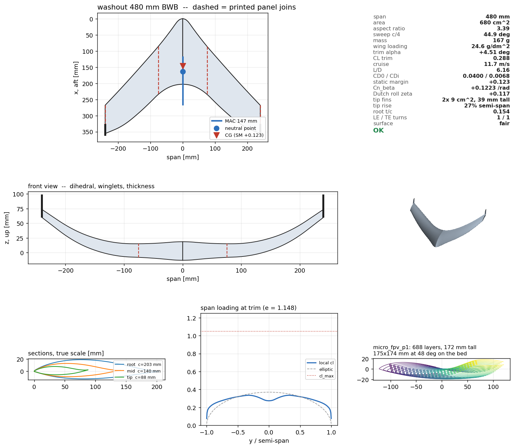
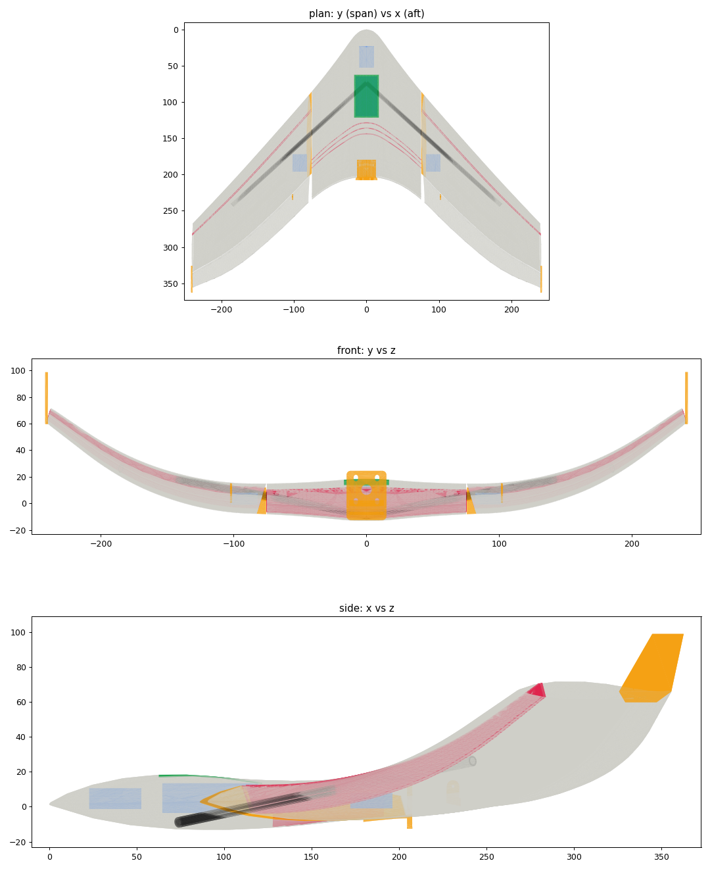

# washout

Automated blended-wing-body design, from a design vector to a
vase-mode-printable STL, judged the whole way by physics rather than by
taste.

Two halves that only make sense together:

- a **search** that shapes a tailless blended wing body against a vortex
  lattice on its own mean camber surface, with a fidelity ladder up to a
  GPU lattice-Boltzmann tunnel, and
- an **exporter** that turns the winner into parts a slicer will print in
  spiral-vase mode — one bead per layer, no infill, no supports —
  with every reason that could fail checked as a gate, not hoped for.

The reference point is
[Beachless/Vase-Wing](https://github.com/Beachless/Vase-Wing), an OpenSCAD
vase-mode wing generator. That takes an aerofoil you chose and gives you
a printable wing. This chooses the aerofoil, the planform, the twist, the
reflex and the CG for you, because it can measure whether they fly.

## What it produces

The gen12 `micro_fpv`, the first design that is buildable exactly as drawn: a 480 mm tailless blended wing
body, 167 g, cruising at 11.7 m/s with a static margin of +0.123, printed as spiral-vase panels with no infill or supports.



*The design sheet the search writes for every finalist: planform with the printed panel joins, CG and
neutral point, front view, true-scale sections, span loading at trim against elliptic, the vase-mode
layer stack, and every gate's measured value.*



*The as-built CAD: printed walls, the carbon spar sliding through the shell's own cavity, the battery and
electronics bays, the motor mount and the tip fins, all placed by the exporter rather than by hand.*

## Quick start

**What you need:** Python 3.10 or newer on Windows, macOS or Linux. The search and the export are CPU-only
(numpy and scipy). A GPU is needed only for the optional wind-tunnel tiers (see
[The fidelity ladder](#the-fidelity-ladder)), and OpenCASCADE only for STEP/CAD export.

**1. Install** (a virtual environment keeps it separate from your other Python projects):

```bash
git clone https://github.com/vmakarov28/washout.git
cd washout
python -m venv .venv
.venv\Scripts\activate          # Windows; on macOS/Linux: source .venv/bin/activate
pip install -e ".[dev]"          # numpy, scipy, matplotlib (for the design sheet), pytest
```

**2. Build your first plane (about 10 seconds).** This rebuilds the gen12 `micro_fpv` shown above from its
tracked design vector:

```bash
python run.py export --mission micro_fpv --design results/fleet/gen12_micro_fpv_v171/design.json --polar data/polars/trainer_mid_re60k.csv@60000,data/polars/thin_reflex_re100k.csv@100000 --out out/first_plane
```

`out/first_plane/` now holds:

| file | what it is |
|---|---|
| `design.png` | the design sheet: planform, CG, sections, span loading, every gate |
| `*_p0.stl`, `*_p1.stl`, ... | the wing panels, ready for spiral-vase mode |
| `*_elevon*.stl`, `*_motor_mount.stl`, `*_horn.stl`, `*_tip_fin.stl`, `*_insert*.stl` | the other printed parts |
| `BUILD.md` | slicer settings and assembly order: read it before slicing |
| `BOM.md` | the parts list (spar tube, motor, servos, battery) |
| `FLIGHT_TEST.md` | the balance point and a first-flight card |

**3. Check that everything works** (about 8 minutes; the suite is the specification):

```bash
python run.py check --mission trainer_v3    # re-scores a tracked design in ~8 s
python -m pytest -q
```

**4. Design your own.** A search evaluates 350 designs per generation at roughly 2 s each per core, so give it
workers. Rough times measured on a Ryzen 9 7900X:

| search | one worker | `--workers 12` |
|---|---|---|
| one generation | ~13 min | ~1 min |
| `--iters 60` (the default) | ~13 h | ~1 h |

```bash
python run.py search --mission micro_fpv --workers 12 --iters 60 --polar data/polars/trainer_mid_re60k.csv@60000,data/polars/thin_reflex_re100k.csv@100000 --out out/my_search
python run.py export --mission micro_fpv --design out/my_search/design.json --polar data/polars/trainer_mid_re60k.csv@60000,data/polars/thin_reflex_re100k.csv@100000 --out out/my_search
```

Each progress line is the best design so far and every gate it still fails; the list shrinking is the search
working. The missions (`trainer_v3`, `demon1`, `micro`, `micro_fpv`) are declared in `design.MISSIONS`, and
`python run.py --help` lists every printer and build setting.

## The idea in one line

Stand the panel on its **root** so span becomes print Z, and every layer
of a lofted wing is exactly one closed aerofoil contour — which is
precisely what spiralize mode needs.

Three consequences follow, and they are enforced as gates:

1. **Span becomes print height.** Panels taller than the Z envelope are
   split spanwise automatically and rejoined on a spar.
2. **Bed footprint is chord × thickness**, so root chord is capped by the
   bed *diagonal* — the exporter finds the best rotation.
3. **Sweep and taper become overhang**, measured perpendicular to the
   previous loop (not by point index — points slide tangentially as the
   chord shrinks, and that is not an overhang).

And one gift: the spar runs spanwise, which is now the print Z axis, so
**the spar channel needs no hole through the single wall**. The shell's
own cavity *is* the channel; a carbon tube slides in after the print.
`spar_fit` checks the tube clears every layer.

## Run it

New here? Start with [Quick start](#quick-start); this section is the full reference.

```bash
python run.py check  --mission trainer_v3          # re-score the tracked design
python run.py search --mission trainer_v3 --iters 90 --out out/run1
python run.py export --mission trainer_v3 --design out/run1/design.json --out out/run1
python run.py export ... --step                     # and cad/: STEP files + 3D gates
python -m pytest -q                                 # the validation gates
python scripts/fleet/gen7.py launch | status | pick # the whole fleet, the whole machine
```

`--workers N` evaluates each generation of a search in N processes. One
search on one core leaves most of a machine idle; the gen7 runner starts
twelve searches of three workers -- deliberately more workers than
threads, so a generation's stragglers and a finished search's cores are
always taken -- at below-normal priority, detached, so they outlive the
shell that started them.

`--step` needs the OpenCASCADE bindings (`pip install -e .[cad]`); the
search never does. It writes `cad/<name>_assembly.step` -- the aircraft
in the flight frame, both halves and the spar tubes, every part and face
named -- and one STEP per printed part in its print frame. Each part is a
handful of named B-spline faces and planar end caps, not a triangle
soup, and the export reports how far the surfaces are from the print and
whether each tube is inside the wing, as gates. See
[`docs/ROADMAP-CAD.md`](docs/ROADMAP-CAD.md).

Missions are `trainer_v3`, `demon1`, `micro` and `micro_fpv`, declared
once in `design.MISSIONS`. To rebuild a
design already in the repo, and to see the whole pipeline run end to end:

```bash
python run.py export --mission trainer_v3 --design results/fleet/gen5_trainer_v3_v101/design.json --polar data/polars/trainer_mid_re60k.csv@60000,data/polars/thin_reflex_re100k.csv@100000 --out out/rebuild
```

Pass `export` the **same `--polar` the search used**. Without it the
export falls back to the flat tier-0 drag model and reports a different,
flattering L/D for the same aeroplane.

Printer envelope, nozzle, layer height, filament density and spar
diameter are all flags — see `python run.py --help`. Defaults are a
256³ bed, 0.4 mm nozzle at 0.45 mm width, 0.25 mm layers, LW-PLA at
0.60 g/cc.

## Real structure, not just a shell

Spiralize prints ONE contour per layer, so at first glance the shell can
have no internal structure: a rib joined to the skin is a T-junction and
the curve stops being simple. The way round it — the one
[Vase Mode Wing](https://vmw.deneb-systems.com/#studio) uses — is that a
rib is not a separate loop, it is a **detour of the skin loop**:

```
upper  ------.        .------------
             |        |
             |  rib   |     <- two legs, one bead apart
             |        |
lower  ------'--------'------------  (gap = one bead: welds, never touches)
```

Topologically still one simple closed curve; physically a welded web.
Ribs sweep chordwise as Z rises, so the stack becomes a diamond truss.

Two invariants hold the rest of the pipeline together. Point count per
layer is **constant** — the skinner joins layer *k* index *i* to layer
*k+1* index *i* — so the skin is reparametrised around the ribs rather
than having vertices deleted. And the caps are **ear-clipped**, not
laddered between upper and lower surfaces, because a rib detour doubles
back in x.

The rib sweep is a **budget, not an allowance**. A tapered swept panel
already spends 37.9° of a 50° overhang limit moving its own section
sideways before any rib exists; the truss gets the remainder. Sizing the
rib against the full limit gave 58° of real overhang — and because the
excess came from the wing, it was independent of rib pitch, which is
what eventually identified it.

`structure.py` then sizes the spar: the lightest stock carbon tube that
passes ultimate load (1.5× limit) and a tip-deflection limit, from the
VLM's own span loading rather than an assumed elliptical one. Rib pitch
comes from plate-buckling of the compression skin. Both are calculations,
not defaults.

## Designing for a beginner

`Mission.beginner_trainer()` is judged against one question: what happens
when a first-time pilot lets go of the sticks? That needs a big static
margin, real dihedral, low wing loading, and — the important one — a
**stall-progression gate**: the tip must work at least 12% below the peak
section cl, so the root lets go first and the nose drops instead of a
wing. A flying wing that drops a tip on launch is how beginners lose them.

Two things that gate turned up. Static margin is **pinned by sweep**, not
by reflex or camber: it moves only with CG position, and the battery
cannot go further forward without the pack hanging off the nose. Sweeping
the leading edge moves the neutral point aft instead — 38° → SM 0.081,
46° → 0.240, 54° → 0.390. And the optimizer will happily trim at +14.3°
if you let it, because the lattice is inviscid and tier-0 drag has no
alpha dependence, so `max_trim_alpha_deg` caps it.

## The fidelity ladder

A D3Q19 run of a whole aircraft is hours; differential evolution wants
thousands of evaluations. Putting the tunnel in the loop would buy one
design a week. So the tunnel is spent where it changes a decision:

| tier | model | cost | used for |
|---|---|---|---|
| 0 | VLM + flat-plate Cf | ~0.4 s | the search — thousands of designs |
| 1 | 2D LBM section polar | ~1 min | the finalists' sections |
| 2 | 3D LBM whole aircraft | hours | the one you are going to print |

Tier 1 replaces the weakest number in tier 0: profile drag, guessed by
Prandtl-Schlichting with a form factor and a printed-surface roughness
multiplier, and wrong by 20-40% on a 10%-thick section at Re 100k-400k
where the boundary layer is transitional. That is exactly the regime
`windtunnel-sim` was validated in (Phase 6, MH45 at Re 20k).

`aero/tunnel.py` **shells out** to that repo rather than importing it.
The tunnel needs CUDA, and it has its own units discipline and its own
validation gates; importing the solver here would fork those rules.
Writing a scene file and calling its entry point keeps one source of
truth for the physics — and lets polars be produced on the WSL/GPU side
while the search runs anywhere. Polars are cached by a content hash of
the CST coefficients and Reynolds number, so a repeat section is free and
a miss is a deliberate spend.

| α = 4° | α = 13° |
|---|---|
|  |  |

*Tier 1 in action: one section in the 2D lattice-Boltzmann tunnel (vorticity, red/blue = opposite spin).
At low Reynolds number the wake sheds even at 4°; by 13° the separated wake is several times wider. This
is the drag that tier 0's flat-plate estimate cannot see.*

### Tier 2, with smoke, and a viewer

```bash
python scripts/tunnel3d.py --mission micro_fpv --design results/fleet/<folder>/design.json --alpha trim
```

This voxelises the aircraft and writes a scene, then runs the tunnel's
`run3d.py` in WSL. It runs under a memory cap and a CUDA allocator cap,
because the VM is shared. A three-colour smoke rake runs upstream of the
wing. The result has four parts:
- tunnel photographs from three cameras (`tunnel/frames/`);
- the spanwise lift from the circulation of the averaged flow, against the
  vortex lattice (`span_loading.png`, `report.json`);
- the same lift from the momentum-exchange total, as a check;
- a bundle for the tunnel repo's browser viewer.

To walk around the flow:

```bash
python ../windtunnel/scripts/serve_viewer.py out/tunnel3d/<run>/tunnel/viewer
```

Then open http://localhost:8765. The viewer shows:
- the animated smoke;
- the vortex cores;
- a movable crossflow plane of speed;
- streamlines;
- the aircraft coloured by surface pressure.

At 68 cells on the mean chord a run is about 30 min, at Re 15k: ten times
below flight. Read the shape of the flow, not the coefficients.

## Why the design vector looks like this

**CST (Kulfan) sections.** The optimizer needs a small, always-valid
parametrization, and blending two point clouds is ill-defined while
blending two coefficient vectors is a lerp. Fitting is linear least
squares, so any Selig `.dat` becomes a design vector exactly.

**Reflex is a trailing-edge deflection, not a coefficient nudge.** This
one cost an afternoon. The class function `C(x) = x^0.5 (1-x)` is *zero
at x = 1*, so `C(x)S(x)` pins the camber line to the chord line at the
trailing edge: a reflexed section is literally unrepresentable without an
explicit `x·z_te` camber term. Fitting one anyway produces a violent
downward hook over the last 1% of chord, which behaves like a large
*down*-flap — and Cm0 comes out with the wrong sign. Both terms now
exist: `te_gap` (opposite signs on the two surfaces) is thickness,
`te_camber` (same sign) is camber.

**Battery position is a design variable.** On a tailless aircraft the CG
is the strongest single lever on trim. Fixing it by hand and optimising
the wing around it is solving the problem backwards; the pack is the one
part that is trivial to slide.

**Cruise speed is an output, not an input.** A wing with fixed elevons
trims at *one* lift coefficient, set by camber, twist and CG. So trim
fixes CL, and speed follows from wing loading:

```
Cm(alpha) = 0  ->  CL_trim  ->  v = sqrt(2W / (rho S CL_trim))
```

A design that trims at CL 0.15 is not "efficient", it is a 30 m/s
aeroplane. The mission band is what says whether that is what you asked
for.

## What the gates actually caught

Each of these was a real bug, and each is now a test in
`tests/test_validation.py`:

- **Cap winding inverted** — both STL end caps wound against the side
  ring, giving exactly 2N inconsistent windings and a mesh a slicer would
  quietly patch for you.
- **Wall-separation gate measured the wrong thing** — the y-difference of
  rotated points instead of the rigid-body distance, and it included the
  shared leading-edge point, whose thickness is trivially zero. Every
  design failed.
- **Overhang measured against nominal layer height** while the search
  sampled coarsely — reported 82° of overhang on a wing that has 42°.
- **Reflex sign inverted** (above), which made every tailless design
  untrimmable.
- **Best-score tracking returned infeasible designs** — the penalised
  score exists to give the optimizer a slope back into the feasible set,
  not to define the answer.

Independent cross-checks that hold: the skinned mesh's
divergence-theorem volume agrees with the planform's section-area
integral to 0.3%; the VLM puts the aerodynamic centre at 0.2473c, reaches
2π in the 2D limit, gives Oswald e = 0.99 for an elliptic wing and less
for a rectangular one, and reproduces published NACA 4412 Cm.

## Known limits, stated because the objective weighs them

- The VLM is **inviscid**: there is no stall and no separation. CL_max
  comes from section data, never from the lattice. Post-stall behaviour
  is outside its reach entirely.
- Lift slope runs a few percent below lifting-line at moderate AR. That
  is the normal lifting-line-vs-lifting-surface gap, not an error, but it
  is a systematic bias in absolute L/D.
- Tier 0 profile drag is an estimate. Absolute L/D should not be quoted
  from a tier-0 number; rankings are far more trustworthy than levels.
- MH45's own reflex sits close to the CST fit's resolution. The seed does
  not perfectly reproduce its published Cm0, which is why reflex is an
  explicit design variable rather than something inherited from the seed.
- Structure is sized against **bending, ultimate load, tip deflection and
  skin buckling** (`structure.py`) — but not against **torsional
  divergence, control reversal or flutter**, which are unmodelled
  entirely. demon1 is scored at 44 m/s on a single-wall foamed-PLA shell,
  so this is the gap that matters most on the fastest aircraft.
- The **hand launch** is not modelled. `min_thrust_weight` is a proxy for
  it, and for a trainer the launch is the flight phase most likely to end
  the aeroplane.
- **Bonding mass is not modelled.** The spars themselves are now weighed
  as fitted, but adhesive and tube joiners are not: that mass follows
  from bonded area, which becomes a real quantity only when the joints
  get their shear gate (`docs/ROADMAP-BUILD.md`, C1/C2). It is a known
  optimistic omission of a few grams, left as a debt rather than filled
  with a guess.
- The measured polars are of **two different sections** (28% apart in
  t/c), so the Reynolds trend between them is partly a thickness
  difference, and the search can reshape a section without the drag model
  noticing. `docs/ROADMAP.md`, item 5.

## Layout

```
washout/
  geom/      cst.py         CST sections, fitting, blending, reflex deflection
             planform.py    BWB stations, lofting, planform integrals
             fairness.py    is it one continuous shape? checked before anything expensive
  aero/      vlm.py         vortex lattice on the mean camber surface
             performance.py mass budget, trim, static margin, drag build-up
             lateral.py     Cn_beta, Cl_beta, the roll/yaw ratio
             dynamics.py    Dutch roll, spiral and roll modes as eigenvalues
             fins.py        tip fins: area, drag, mass, yaw stiffness
             tunnel.py      bridge to the LBM tunnel; cached section polars
  printing/  vase.py        layer stacks, TE thickening, printability gates
             ribs.py        the internal truss as a detour of the skin loop
             stl.py         watertight skinning, binary STL
  search/    design.py      design vector, mission, gates, scoring
             optimize.py    differential evolution
  structure.py              spar sizing, skin buckling, tip deflection
  spars.py                  where the spanwise tubes go and how far they reach
  propulsion.py             motor, propeller, battery: thrust against airspeed
  report.py                 the design sheet -- does it look like an aeroplane?
run.py                      CLI: search, export
data/polars/                the only measured data here, with its sections
results/fleet/              the three aircraft, as design vectors
scripts/                    tunnel sweeps, reports, contact sheets
scripts/fleet/              the generation runners, gen1 to gen5
tests/                      the gates above
docs/ROADMAP.md             what is missing, in value order
```
